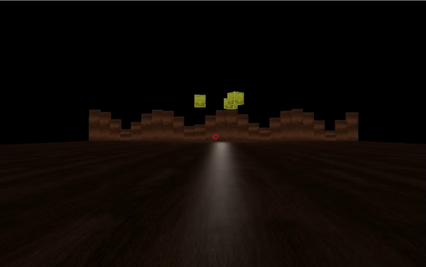

# Three.js Webpack Starter tayken by Grzegorz te predjus sem dżus ;)

[](https://app.netlify.com/sites/angry-kowalevski-3651fc/deploys)

## Work in progress, hope Anna will like it ;)
Latest deploy: https://angry-kowalevski-3651fc.netlify.app/ ( loading takes w while: free & slow Netlify, big textures )

## Controls:

W,S,A,D: move/strafe
Space: shoot
Mouse: look around



Courtesy of Bruno Simon of https://threejs-journey.xyz/

## Setup

``` bash
# Install dependencies (only the first time)
npm install

# Run the local server at localhost:8080
npm run dev

# Build for production in the dist/ directory
npm run build
```
